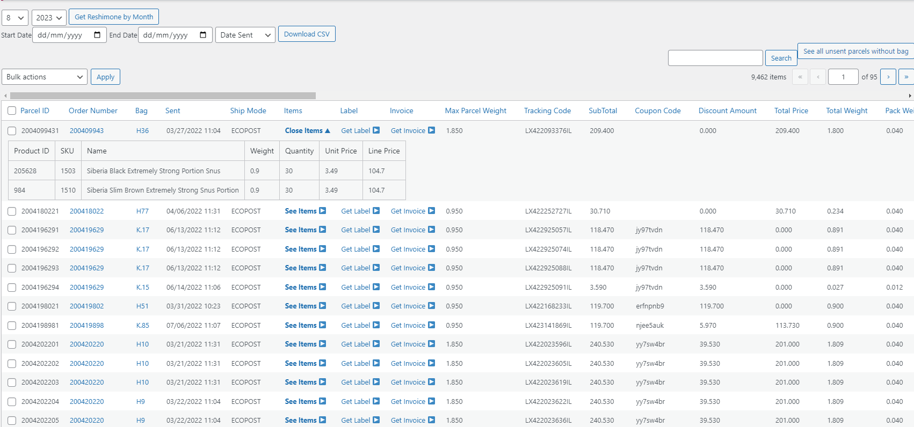
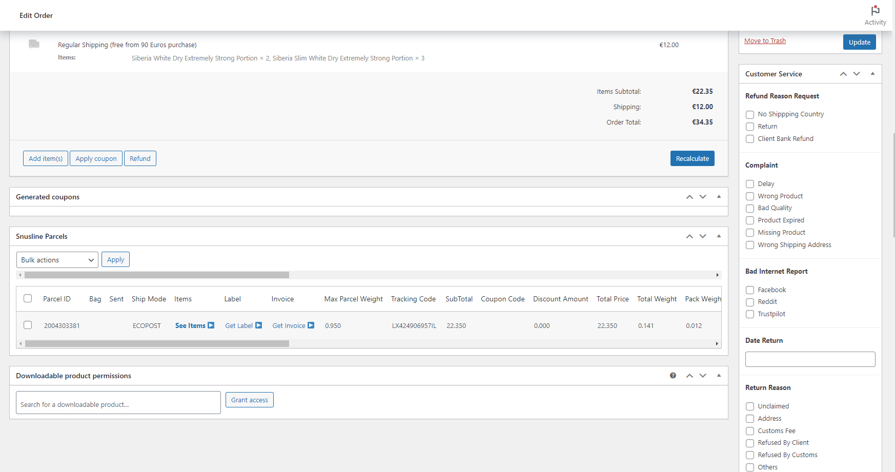
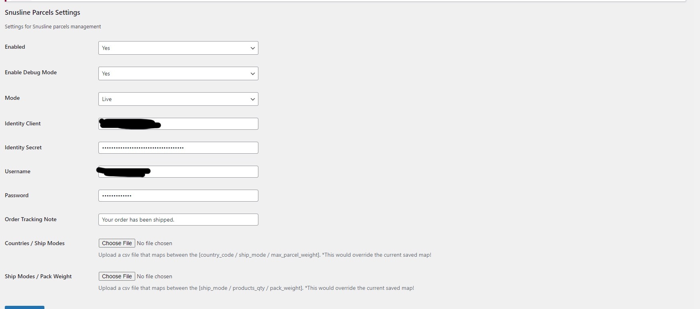
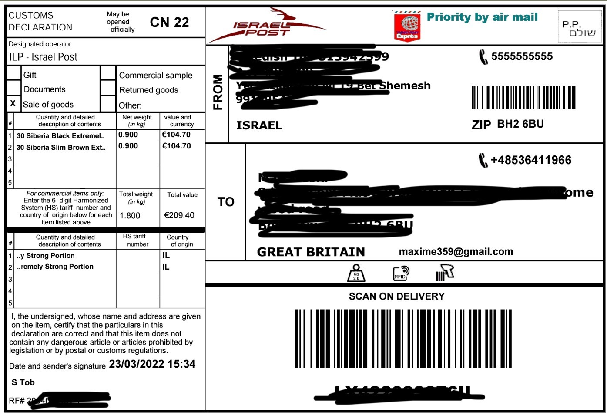
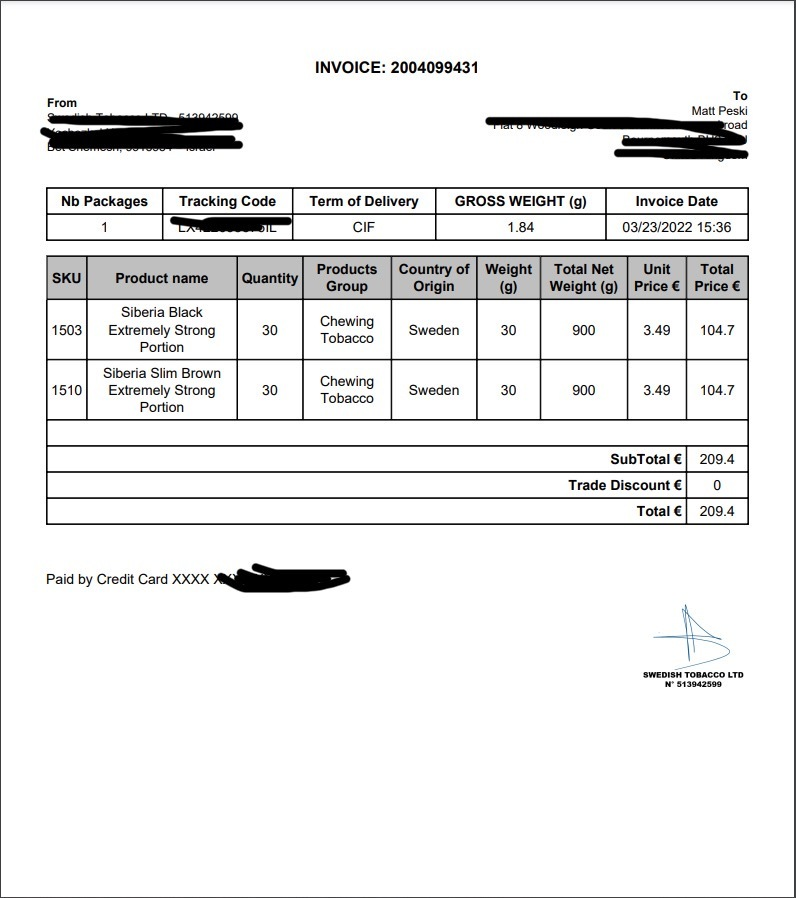

Sure, here's a README.md template you can use for your GitHub repository for the WordPress custom plugin named "IsraelPost-WooCommerce-Plugin":

```markdown
# IsraelPost-WooCommerce-Plugin

## Overview

IsraelPost-WooCommerce-Plugin is a custom WordPress plugin that provides functionality for managing parcels and shipping using the Israel Post API. It integrates with WooCommerce to offer shipping solutions for your WooCommerce store.

## Features

- Generate parcel labels for orders and shipments using the Israel Post API.
- Update tracking information for parcels to keep customers informed about their orders.
- Integration with WooCommerce to streamline the shipping process for online orders.

## Installation

1. Download the plugin ZIP file from the [GitHub repository](https://github.com/izhan1511/IsraelPost-WooCommerce-Plugin).
2. In your WordPress admin dashboard, go to "Plugins" and click "Add New."
3. Click the "Upload Plugin" button and select the ZIP file you downloaded.
4. Activate the plugin.

## Screenshots

Insert relevant screenshots here to provide a visual representation of how the plugin works.







## Usage

### Generating Parcel Labels

The plugin provides a class `Trus_SLParcels_API` that allows you to generate parcel labels using the Israel Post API. You can use the `generate_parcel_label` method to generate labels for your parcels.

Example usage:
```php
$parcel = array(/* parcel data */);
Trus_SLParcels_API::generate_parcel_label($parcel);
```

### Updating Parcel Tracking Information

To update tracking information for parcels, you can use the `update_parcel_tracking_info` method provided by the `Trus_SLParcels_API` class.

Example usage:
```php
$parcel = array(/* parcel data */);
Trus_SLParcels_API::update_parcel_tracking_info($parcel);
```

## Configuration

The plugin requires configuration settings to interact with the Israel Post API. You can find and set these settings in the `Trus_SLParcels_Config` class.

## Contributors

- Developer: M Izhan (Website: [Github - izhan1511](https://github.com/izhan1511))

## Support

For any questions or issues related to this plugin, please create an issue on the [GitHub repository](https://github.com/izhan1511/IsraelPost-WooCommerce-Plugin/issues).

---
